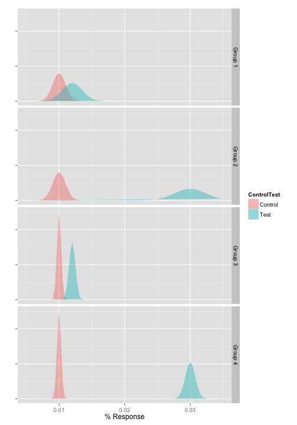
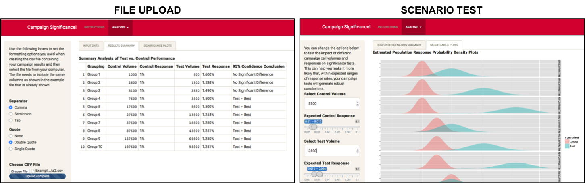

## Has My Marketing Campaign Test Been Successful?

- A/B Testing & Test vs. Control campaigns are essential tools to understand & improve campaign performance  
- However, we can't only look at relative response rates between campaign cells when evaluating performance...  
 - We need to understand if variation is significant [Commonly with 95% confidence]
- A Google [search](https://www.google.com.hk/search?q=marketing+campaign+significance+test&oq=marketing+campaign+significance) shows quite a few online tools that can help such as [RR-Donnelly](http://www.rrdonnelley.com/RMS/ServicesResources/TestResults.asp), [zettasphere](http://www.zettasphere.com/abcalculator/),etc... BUT:
 - DON'T provide a way to evaluate more than one Test vs. Control combination at a time  
 - DON'T provide an intuitive, graphical way of understanding the underlying statistical concepts that are being used to create inference conclusions  
- <span style="color:#DC143C; font-weight: bold"> [The Campaign Significance!](http://bengaff.shinyapps.io/TryFINAL/) application provides an easy, intuitive way for people to understand whether the relative performance of Test vs. Control cells in past or planned campaigns is significantly different </span>

--- 

## Shiny To The Rescue!

[Shiny](http://shiny.rstudio.com/), from RStudio, provides a powerful tool to help create a solution using the power of R  

1 - Users can enter information/parameters about their campaigns  

```r
# Example code in Shiny ui.R file
fileInput('file1', 'Choose CSV File',   # Allow user to select csv file to upload
    accept=c('text/csv', 'text/comma-separated-values,text/plain', '.csv'))
```
2 - Shiny feeds this to R, which can make calculations using the inputs  

```r
# Example code in Shiny server.R file
rawData <- reactive({     # Save raw data either from example or file to upload
    inFile <- input$file1 # Create object to store details of file to upload
    if (is.null(inFile)) exampleData else
        read.csv(inFile$datapath, header=TRUE, sep=input$sep, quote=input$quote)})
```
3 - Analysis based on these calculations is passed back from R and displayed to the user  
4 - The user can easily & quickly change parameters - new results displayed in real time


---

## Using The _Power_ of R...

In the <span style="color:#DC143C; font-weight: bold">Campaign Significance!</span> application:  
1 - The information entered by the user is passed to R  
2 - R performs statistical analysis based on the parameters shown  

```r
# Example code in Shiny server.R file
controlVar <- (controlpHat*(1-controlpHat))/rawDataFrame$Control.Volume
testVar <- (testpHat*(1-testpHat))/rawDataFrame$Test.Volume
differenceSE <- sqrt(controlVar+testVar)
```
3 - The [ggplot2](ggplot2.org) package is used to create probability density plots to better visualise significance  
Show example code & chart
 


---

## The Solution: Campaign Significance!

- [The Campaign Significance!](http://bengaff.shinyapps.io/TryFINAL/) application provides an easy, intuitive way for people to understand relative performance of Test vs. Control cells in past or planned campaigns:  

<span style="color:#DC143C; font-weight: bold">FILE UPLOAD</span>: Upload & evaluate response information in CSV format for completed campaigns  
<span style="color:#DC143C; font-weight: bold">SCENARIO TEST</span>: Specify & evaluate response for a planned Test vs. Control campaign  
<div style='text-align: center;'>
    
</div>
